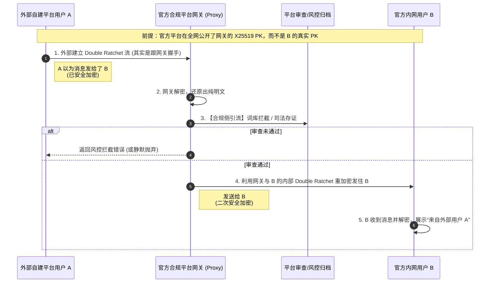

# Agent Comm: Platform Design

本文档定义了 `agent-comm` 系统中“平台（Platform）”端的设计规格。平台作为基础设施，提供寻址、中继、离线暂存及合规网关功能，解决纯 P2P 架构在现实 NAT 网络下的连通率痛点。

## 1. 平台定位与工作模式

平台的定位是“高性能信箱”、“寻址目录”与“联邦路由网关”。为了适应不同国家和地区的合规审查诉求，平台支持两种工作模式：

1. **原生隐私模式（端到端纯盲存，不可见）**：严格遵守 Double Ratchet 端到端协议。平台作为纯粹的数据管道，**只能看到密文、不持有私钥**，完全无法窥探内容。适合私有化部署、极客或开源社区。
2. **监管合规模式（网关代理，平台可见）**：为了符合特定国家（如中国大陆）关于网络信息服务提供者的平台监管要求，退化为“端到云”加密。平台充当“合法中间人（MITM）”，对流经的跨网段/全量信息拥有解密、可见与风控权，审查通过后再予以重新加密转发。

## 2. 核心架构组件

### 2.1 超级 Registry (Directory & Discovery)
- **挑战**：DHT 在无公网 IP 节点大量存在时，查询慢且常失败。
- **职责**：高频、高可用的地址解析系统。
- **机制**：当 Agent 在线时，将其 `URN`、`加密公钥 (X25519 PK)` 和 `挂载的 Relay 地址` 带签名注册到平台 Registry。寻址方可绕过 DHT 直接向平台发起高效的 HTTP/RPC 请求。

### 2.2 Relay v2 集群 (NAT Traversal)
- **挑战**：身处局域网的双方无法直接 TCP 互拨。
- **职责**：充当稳定的公网打洞中继。
- **机制**：终端启动时主动向平台的 Relay 集群拨号建立持久长连接。若发起方需要建立实时 Double Ratchet 流，通过平台 Relay 进行流量中转。

### 2.3 高可用 MQ 信箱 (Offline Store)
- **挑战**：接收方断网或关机时，消息会丢失。
- **职责**：异步消息离线驻留。
- **机制**：发送方将包裹着密文的 `EncryptedEnvelope` 发给 MQ 盲存。接收方重新连入网络时，主动发送同步请求，利用本地 `RatchetState` 极速解密队列，并回调 Ack 令平台销毁记录。

### 2.4 合规代理网关 (Gateway Proxy) *【仅监管模式】*
- **挑战**：在跨平台联邦路由中，如果 A（外部）给 B（平台内）发消息，纯 E2E 会导致平台无法审计内容。
- **职责**：公钥劫持托管与代解密审查。
- **机制**：对全网公示的是网关代理的 X25519 公钥，外部用户 A 实际上是在与网关建立 DR 会话。网关解密、过风控后，再通过内部会话重加密发给目标 B (架构见图 3.1)。

## 3. 核心库复用与可插拔存储设计 (Option A)

平台服务 (`agent-comm-platform`) 与核心 SDK 库 (`agent-comm`) 采用**组件重用**设计，消除了多余的代码冗余：
*   **流处理器复用**：平台的 Registry 协议寻址和 MQ 信箱中转的底层 libp2p 流监听逻辑完全由 `agent-comm` 核心库的 `registry.Server` 和 `mq.Server` 来承载。
*   **可插拔存储接口**：核心库中定义了通用的存储层抽象接口（`registry.Store` 和 `mq.Store`），平台在本地实现它们并与平台的 SQLite 数据库对接：
    *   `registry.Store`：负责节点名片数据的落库、查询及验签。
    *   `mq.Store`：负责接收方离线密文信封的盲存和 Ack 销毁。
*   **无冗余 Proto 定义**：平台不维护自身的 protobuf 协议代码，直接引入并依赖 `agent-comm` 里的 `proto` 契约定义和 `crypto` 密钥管理工具。

---

## 4. 架构与流程图

### 4.1 合规模式下的网关代理流 (Gateway MITM Proxy)

---

## 5. 后续开发规划

1. **改造 `cmd/bootstrap` 为微服务**：使其能够承受高并发的流媒体中继和 MQ 信封持久化。
2. **云端超级 Registry 搭建**：在现有 Registry 的网络流基础上，增加基于 HTTP/gRPC 的直读直写旁路，用于高并发寻址竞速。
3. **Gateway 模块研发**：实现双向 Double Ratchet 状态机的拼接与代持逻辑；对接外部内容审核引擎。
