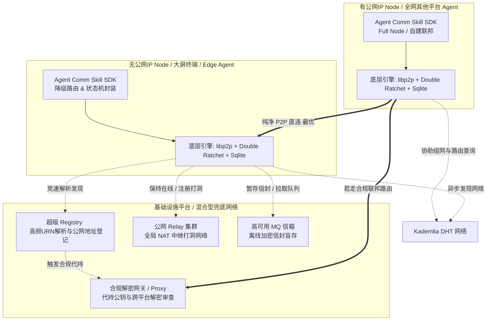
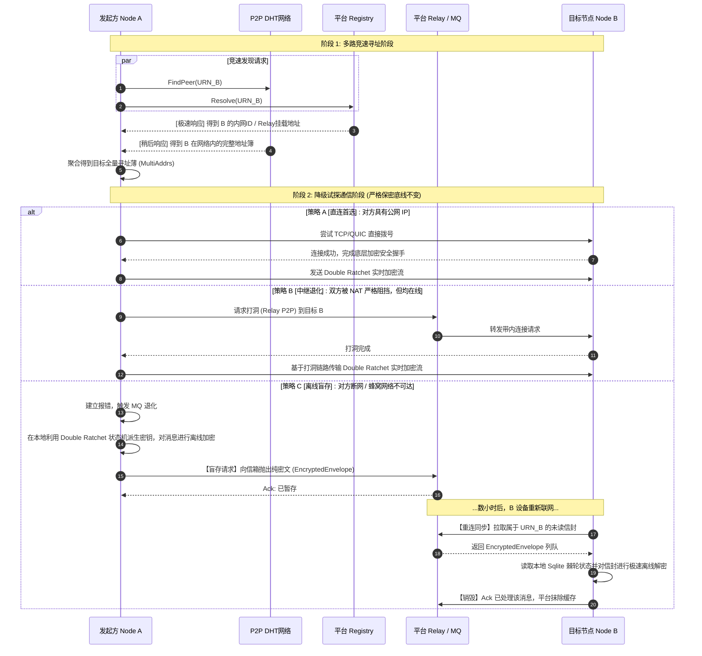
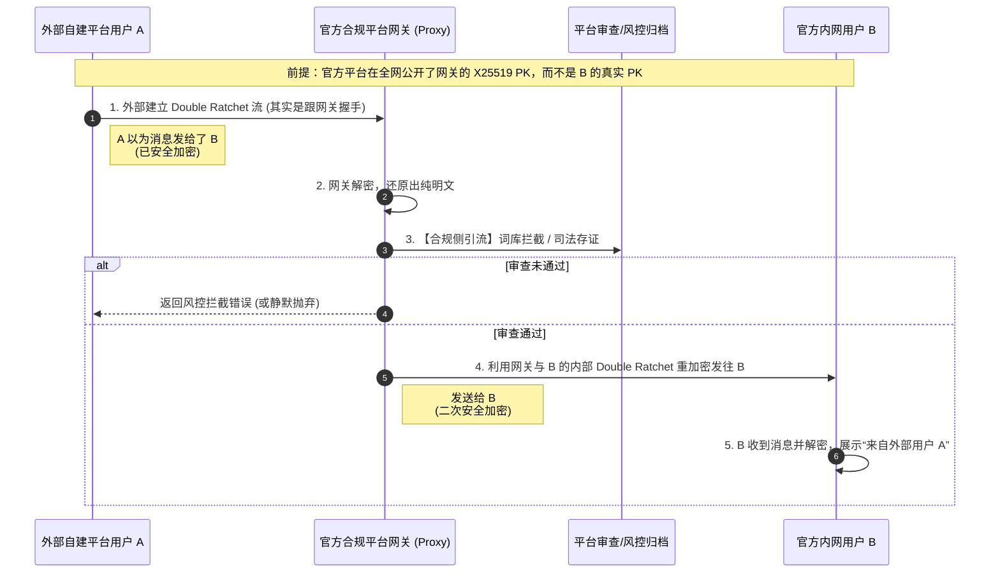

# Agent comm system design

由于大部分用户和 Agent 运行在严格的 NAT 之后（没有公网 IP），纯基于 libp2p Kademlia DHT 和直连的架构会面临严重的可达性和稳定性问题。为了解决 NAT 穿透、节点发现及离线消息问题，同时**绝对保证现有的端到端加密（Double Ratchet）和自证明身份特性不被破坏**，提出以下混合架构补充方案：

## 1. Agent Comm Skill（Agent 与用户侧的工程化封装）
提供开箱即用的一键部署能力，抹平复杂的加密与 P2P 底层概念。
- **自适应网络路由与降级策略**：Agent 启动时自动通过 AutoNAT 获取网络状态。
  - **有公网 IP 时**：作为 DHT 网络的一等公民（Full Node）运行，直接参与 Kademlia 路由，监听公网端口，接受直连请求，甚至可以自愿开启 Relay 服务反哺社区。
  - **无公网 IP 时 (NAT)**：自动 fallback，主动挂载到“云平台”的高可用 Relay 节点上，以 Client 模式运行。
- **标准化的调用接口**：提供更友好的 `InitIdentity()`, `SendMessage(urn, msg)`, `Listen()` 等高级 API，封装背后的 X25519 握手与消息轮转。
- **用户端侧联动**：用户可以通过工具快速生成身份，通过复制 URN/扫码与 Agent 完成身份验证（Phase 4a WoT 的简化版），无缝发起加密会话。

## 2. 平台 (公共通信基础设施)
平台的定位是“高性能信箱”和“寻址目录”，专门解决公网 IP 缺失的问题。为了适应不同国家/地区的运营合规要求，平台可支持两种工作模式：

1. **原生隐私模式（端到端纯盲存，不可见）**：严格遵守 Double Ratchet 端到端协议。平台**只能看到密文、不持有私钥**，完全无法窥探且无法篡改内容。适合开源社区、极客或不受特定内容审查监管的私有部署。
2. **监管合规模式（网关代理，平台可见）**：为了符合特定国家（如中国大陆）关于网络信息服务提供者的平台责任与内容审查法规，Agent 通信会退化为“端到云”加密（类似微信）。发送方将消息加密发给平台 -> 平台解密并执行内容词库审计/存档 -> 平台再重新加密转发给接收方。在此模式下，平台实质上充当了“合法中间人”，对途经的信息拥有可见与管控权。

### 2.1 注册（公示）身份 id (Directory & Discovery)
- **痛点**：在大量无公网 IP 节点存在的网络中，DHT 的查询成功率和连接率极具挑战。
- **平台角色**：平台充当超级 Registry（可结合现有的 Registry 协议）。节点在线时，向平台公示其 `URN`、`加密公钥 (X25519 PK)` 和 `其挂载的 Relay PeerID 地址`（需携带 Ed25519 证明签名防篡改）。
- **流程**：通信发起方若通过 DHT 无法定位目标，直接向平台查询目标的高可用地址。

### 2.2 云-端应用连接注册 (可靠的 Relay & MQ 离线持久化)
- **痛点**：常规 P2P 节点不稳定，离线存储（Phase 3 的 MQ Server）需要极高稳定性的公网节点。
- **平台角色**：
    1. **打洞与中继 (NAT Traversal)**：平台充当官方的 libp2p `Relay v2` 节点。云端应用和边缘端（用户）启动时向平台建立长连接持久化。
    2. **信箱云端接管 (MQ Store)**：若收件人不在线，发送方直接将 `EncryptedEnvelope` (加密信封) 发给平台平台代存。平台数据库中仅存储盲数据（Blob）。
    3. **状态同步**：用户或 Agent 恢复网络重新连接平台时，平台自动将缓存的离线消息推送给终端，端侧通过 Double Ratchet Session 解密，并发送 Ack 请求平台销毁该条纪录。

## 3. 兼容公网 IP 用户与完全去中心化场景 (Hybrid P2P)
系统设计绝不与平台强绑定。拥有公网 IP 的极客用户、企业级节点能够彻底绕过平台，保留原汁原味的去中心化通信。
- **协议回退 (Protocol Fallback) 与竞速**：
  - **寻址**：当 A 寻找 B 时，通过 `DHT 查找` 与 `平台 Registry 查询` 并行竞速。如果 B 拥有公网 IP，A 会直接从 DHT 拿到其直连地址。
  - **通信**：优先尝试建立 libp2p 直连的 `Double Ratchet` 流；如果直连不通（例如双方均在 NAT 后且非同一个内网），再退化为使用平台 Relay；如果对方离线，最后再使用平台 MQ 盲存。
- **自主基础设施构建与联邦 (Federation)**：
  - **自建私有通信平台**：任何拥有公网 IP 的用户、企业都可以运行自己的 Bootstrap / Relay / MQ 节点（即“自建平台”）。并在 `Agent Comm Skill` 中将网关指向自己的服务器。这类连接与通信完全脱离官方平台，官方平台对此**绝对不可见**。
  - **跨平台联邦路由 (Cross-Platform Routing) 与合规解密**：若 A 企业的自建平台用户，想要联系 B 官方平台的用户，消息会跨域投递。
    - **如果你是平台 B（开启了合规监管模式）**：外部用户 A 想给你的用户 B 发消息。由于你开启了合规模式，平台 B 在全局 Registry 中为 B 注册的实际上是**平台 B 的网关公钥**（合法的中间人 MITM）。因此，外部的 A 以为在和实体 B 建立加密握手，实际上是与平台 B 的网关建立了 Double Ratchet 会话。平台 B 网关收到密文后 -> 解密审查 -> 再用平台与 B 内部的会话重新加密发给 B。
    - **结论**：只要消息的接收方或发送方**有一端**绑定在你的合规平台上，你的平台就必须充当加解密网关，这段跨平台消息对你就是可见的。纯外部网络之间的通信（A 的自建平台发给 C 的自建平台），不会经过你的网关，你无法解密也无需负责。

## 4. 现状与后续演进 (Gap Analysis)

要把这个 Hybrid P2P 蓝图做出来，我们需要理清基础的密码学与 P2P 设施我们已经有了哪些，还需要在业务架构上补充什么：

### 4.1 已有能力 (Already Implemented)
目前的 `agent-comm` 核心库（Phase 1 至 Phase 6）已经完成了最硬核的底层密码学和网络基建：
- **底层网络引擎 (Phase 1)**：基于 `go-libp2p` 的协议栈，内置 TCP/QUIC、AutoNAT 状态感知和基础 Relay v2 节点交互能力。
- **去中心化寻址根基 (Phase 2)**：完全实现的 Kademlia DHT 路由表，支持自证明身份的 `URN -> PeerID -> X25519 PK` 分布式解析。
- **顶级端到端加密体系 (Phase 4b，Phase 5，Phase 6)**：Ed25519 鉴权握手，X25519 ECDH 交换，以及完整的 **Double Ratchet (双棘轮)** 前向保密流协议。并且实现了 SQLite 本地 `RatchetState` 持久化，保证通信连贯。
- **离线盲存协议基础 (Phase 3)**：在 `mq/` 包中已经有了通过 libp2p stream 发送、拉取和删除 `EncryptedEnvelope` (加密信封) 的逻辑，以及支持 SQLite 的测试版 MQ 节点。

### 4.2 待开发/需包装的能力 (To-Be-Developed)
后续要真正工程化落地，主要任务在应用层（SDK）和平台服务端：
- **`Agent Comm Skill` SDK / 服务层 (高优先级)**：
  - 包装底层的流管理、棘轮状态机维护。开放给开发者极简的 `Init()`, `Send(urn, msg)`, `OnMessage()` 钩子 API。
  - **核心逻辑**：内置智能连接器。自动执行“寻址竞速”以及“降级通讯（直连 -> 中继 -> MQ 暂存）”逻辑，向调用方屏蔽复杂的 P2P 连通性异常。
- **云平台超级 Registry 与合规网关 (Compliance Gateway)**：
  - 基于目前的 Registry 协议，开发一个可用作中心化加速的云端服务。支持高效的 URN 更新和并行寻址查询。
  - **网关代理模块**：实现上文所述的“托管公钥/代解密审查”流程。针对合规区域提供“双链路 E2E”代持功能。
- **高可用 Relay 与 MQ 集群**：
  - 将目前的 `cmd/bootstrap` 提升为稳定、可横向扩容的服务端程序。重点在于信箱 (MQ) 的高性能盲存/高并发拉取，以及 Relay v2 的稳定流量打洞。
- **终端 UI 与信任绑定设施 (简化版 Phase 4a)**：
  - 前端：实现 URN 及 PublicKey 的可视化（如二维码/DeepLink）。
  - 让用户端扫描 Agent 暴露的身份信息，确认身份后加入到本地的安全目录，规避中间人攻击。

## 5. 系统架构图与通信流程图 (Diagrams)

### 5.1 Hybrid P2P 混合系统架构图

### 5.2 多路竞速与阶梯降级通信流程

### 5.3 合规模式与跨平台联邦路由 (Gateway MITM Proxy)

为展示第 2.2 节中跨平台通信下网关可见性的底层逻辑，补充该流程图。

